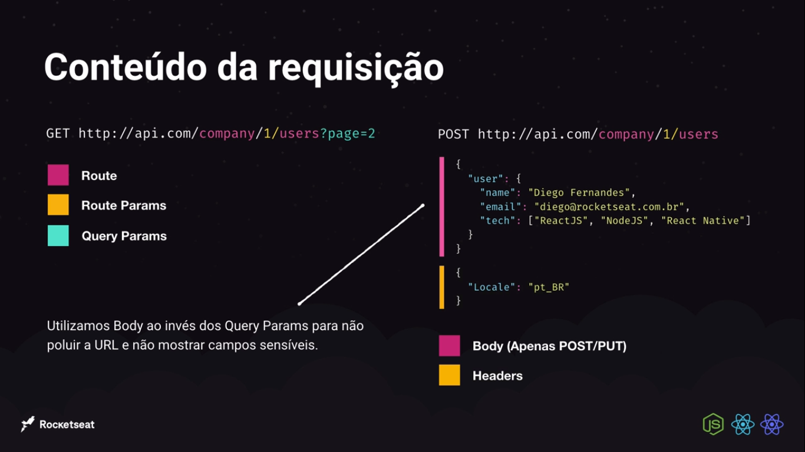

# Back End com node.js

## O que é Node.js?

- JavaScript no Backend;
    - Não lidamos com eventos do usuário final;

        Quando estamos utilizando o Node a unica formas de ouvir o usuário é quando recebemos a rota do usuário;

    - Rotas e integrações.
    - Plataforma (não linguagem); → utiliza uma linguagem JavaScript
    - Construída em cima da V8; → Maquina por trás de chrome e faz dele muito rápido
    - Comparável a PHP / Ruby / Python / Go;

## O que é NPM?

- instalar biblioteca de terceiros;

→ Basicamente permite que baixe ferramenta de terceiros(ex. formas de pagamento como payPal, mercado pago, etc);

- Fornecer bibliotecas;
- Por que utilizaremos o Yarn?

→São semelhantes porem mais rápido e com mais usabilidades;

- Comparáveis:

    →Composer do PHP;

    →Gems DO RUBY;

    →PIP do Python;

## Características do Node

- Arquitetura Event-loop
    - Baseada em eventos(Rotas na maioria das vezes);
    - Call Stack;

        → Nada mais é como uma pilha de evento, que pode ser comparada como uma função, rodando na aplicação sem parar, o tempo todo;

- Node single-thread;
    - C++ por tras com libuv;
    - Background threads;
- Non-blocking I/O;

    →"inpunt e not put não bloqueante" . Não precisa retornar os dados todos de uma vez;

## Frameworks

- ExpressJS como base:
    - Sem oponião;
    - Otimo para iniciar;
    - Micro-Serviços;

        → Exemplos: Catalalogo se pega em micro servicoes, Carrinhos mais micro servico.

- Frameworks Opinados;
    - Nestjs;
    - AdonisJs;

## API REST

## Como funciona?

- Fluxo da requisição e resposta:
    - Requisição feita por um cliente;
    - Resposta retornada através de uma estrutura de dados;
    - Cliente recebe resposta e processa resultado;
- As rotas utilizam métodos HTTP:
    - POST http://minhaapi.com/users
    - GET http://minhaapi.com/users
    - PUT http://minhaapi.com/users/1
    - DELETE http://minhaapi.com/users/1

        🟦 Parâmetros 

        🟦 Recurso / Rota

        🟦Métodos HTTP

        ---

## Benefícios

- Múltiplos clientes(front-end), mesmo back-end; → Ou seja a gente pode ter a mesma estrutura tanto pra mobile, quanto pra web pois teremos uma comunicação com serviços externos
    - Protocolo de comunicação padronizado;
        - Mesma estrutura para web/ mobile / API publica;
        - Comunicação com serviços externos

## JSON (JavaScript Object Notation)

Um uso global, tanto pra mobile, quanto para web. Ou seja, uso global.

## Conteúdo de requisição

<h1>
  
</h1>

## HTTP codes

- 1xx: Informational → Apenas o papel de passar alguma informação
- 2xx: SUCCESS
    - 200:SUCCESS → De sucesso
    - 201:CREATED → "deu tudo certo na criação, foi criado"
- 3xx: Redirection →A gente sofre um redirecionamento
    - 301:MOVED PERMANENTLY →mudou permanentemente
    - 302:MOVED → mudou a rota mas pode melhorar
- 4xx: Client Error
    - 400:BAD REQUEST
    - 401:UNAUTHORIZED → Faltou ter permição
    - 404: NOT FOUND - > classico
- 5xx: Server Error
    - 500:INTERNAL SERVER ERROR

## Métodos HTTP

- GET: Buscar informações do back-end;
- POST:Criar uma informação no back-end;
- PUT/PATCH: Alterar uma informação no back-end;
- DELETE: Deletar uma informação no back-end;

## Tipos de parâmetros

- Query Params: Principalmente →Filtros e paginação →Utiliza o notion a seção query
- Routes Params: Identificar recursos (Atualizar ou deletar)
- Request Body: Conteúdo na hora de criar ou editar uma informação(ATRAVES DO JSON)

    →meio onde busca uma informação para tornar uma atualização ou criação

## Middleware

- Interceptador de requisições que interrompem totalmente a requisição ou alteram dados da requisições;
- Os HTTP pode ser considerados Middleware, mas a sintaxe para unica contrução é o acompanhamento de next;